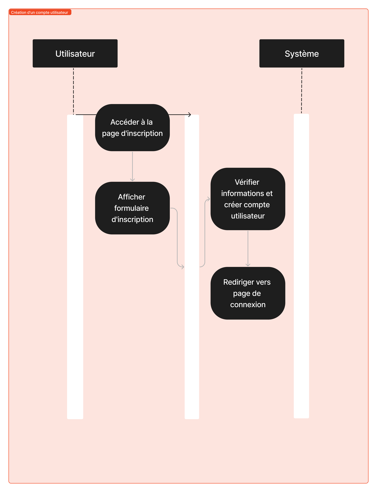
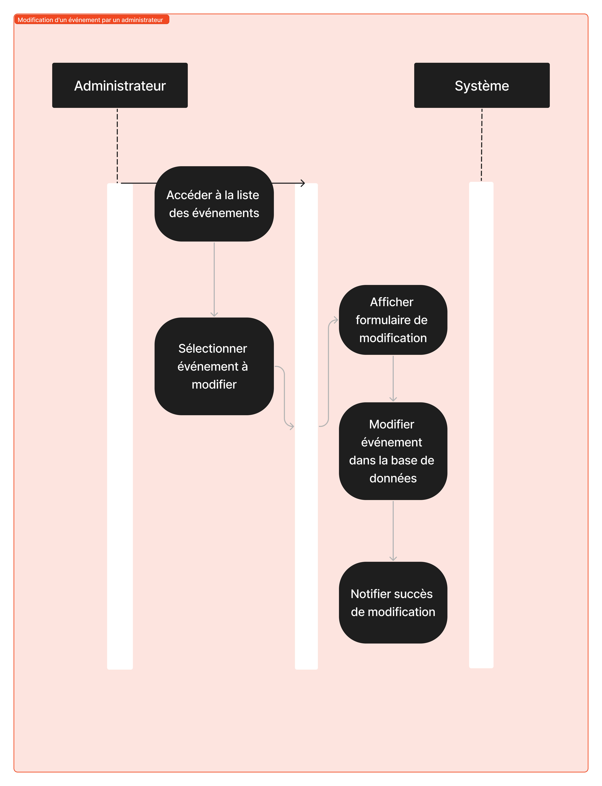

# SCHOLARIS

---

# Plan
- Context
- Organisation
- Choix technique
- Architecture
- Diagrammes UML
- Difficultés rencontrées
- Demo

---

# Contexte
## Besoin

---

# Contexte
## Solution

---

# Organisation

---

# Organisation: Rôles Principaux
## Phase 1

---

# Organisation: Rôles Principaux
## Phase 2

---

# Organisation: Rôles Principaux
## Phase 3

---

# Organisation: Rôles secondaires

---

# Organisation: Rôles secondaires

---

# Organisation: Rôles secondaires

---

# Organisation: Rôles secondaires

---

# Organisation: Rôles secondaires

---
# Choix Techniques

---
# Choix Techniques

---

# Architecture

 

---

# Architecture

 

---

# [Diagramme de classe][1]

[1]:https://www.figma.com/file/tOuymsHwlkMpGUEJfim23b/SCHOLARIS?type=whiteboard&node-id=7-1264&t=IYXDcg8LtwhnwAgs-4

---

# Diagramme cas d'utilisation

---

---

# Diagrammes de séquence

---

Création d'un événement par un administrateur

---

Validation d'une commande par un validateur

---
Création d'un compte utilisateur

---
Consultation des événements à venir par un utilisateur

---
Modification d'un événement par un administrateur

---
Création d'un produit par un administrateur

---
Validation d'une commande par le créateur de l'événement

---

# Difficultés rencontrées: Coté métier

---

# Difficultés rencontrées: Coté métier

---

# Difficultés rencontrées: Coté technique

---

# Difficultés rencontrées: Coté technique

---

# Demo

---

# Merci pour votre attention !

