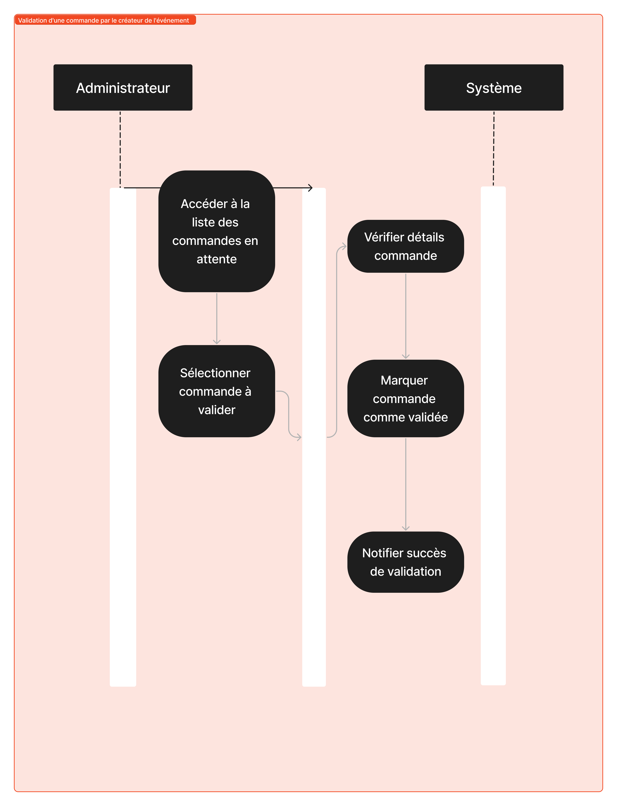
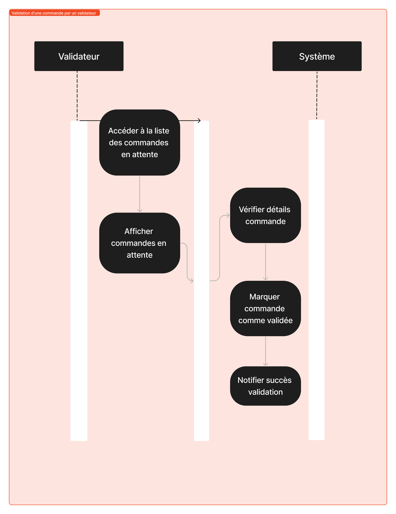
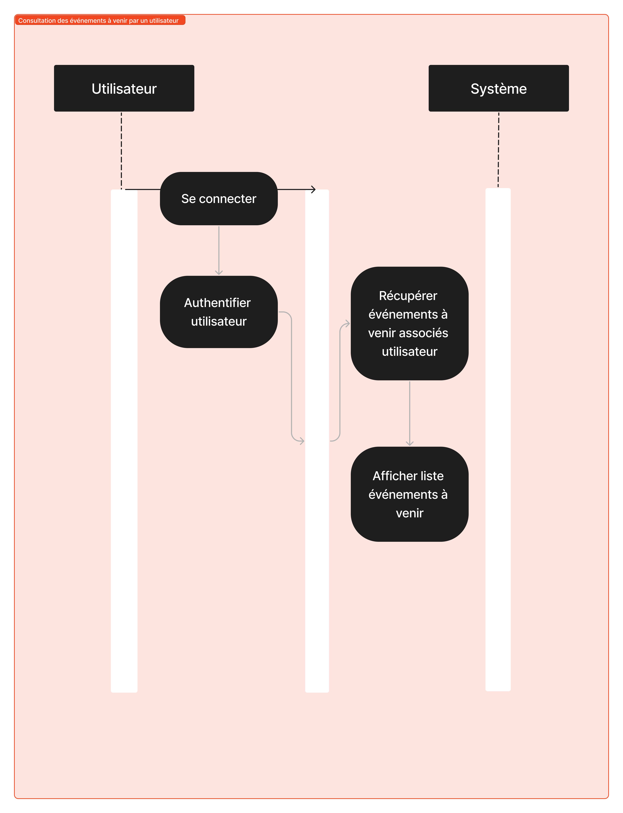
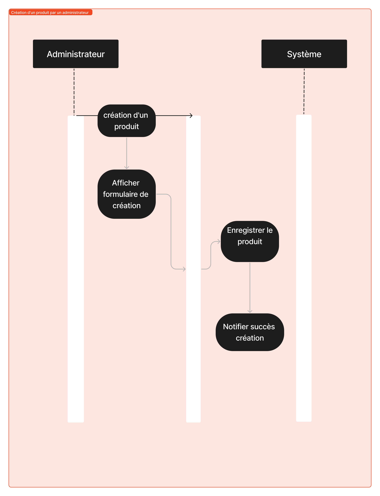

<!-- Vertical centering -->

# Projet "SCHOLARIS"

---

# Contexte

- Modernisation de la gestion d'événements de collecte de fonds pour l'Association des Parents.
- Besoin d'une application web/mobile intuitive pour simplifier la planification, l'exécution et le suivi des événements.

---

# Organisation

- Réalisé par une équipe d'étudiants dans le cadre du projet de fin d'études.
- Chaque membre de l'équipe a contribué avec ses compétences pour assurer le succès du projet.
- Travaillé selon la méthodologie Agile pour une gestion flexible et itérative du développement.

---

# Choix Techniques

- **Java 17** 
- **ReactJS** 
- **PostgreSQL** 
- **Kotlin**
- **JWT** 

---

# Architecture

### Application Web

- **Backend BFF** 

- **Frontend** 

### Application Mobile

- **Android Studio** 

---

---
Création d'un événement par un administrateur

---

Validation d'une commande par un validateur

---
Création d'un compte utilisateur

---
Consultation des événements à venir par un utilisateur

---
Modification d'un événement par un administrateur

---
Création d'un produit par un administrateur

---
Validation d'une commande par le créateur de l'événement

---

<!-- Vertical centering -->

# Merci pour votre attention !

